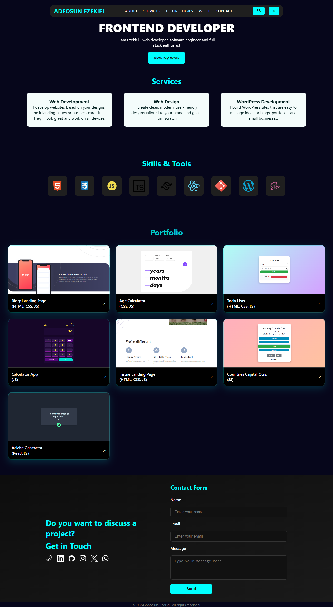

# 🌐 My Portfolio Website
A modern, responsive, and animated portfolio website built with **[Your Tech Stack]** to showcase my projects, skills, and contact information.  
It’s designed to be fast, accessible, and easy to customize.

---

## 🚀 Live Demo
**🔗 [View Portfolio](https://adeosunezekiel.portofolio.com)**

---

## 📋 Features

- **Responsive Design** – Looks great on desktop, tablet, and mobile
- **Smooth Animations** – Engaging UI with CSS/JavaScript animations
- **Project Showcase** – Highlight work with images, descriptions, and links
- **Multilingual Support** – English + Spanish (toggle switch)
- **Dark/Light Mode** – Theme switcher for better accessibility
- **Contact Form** – Send messages directly to my email (via backend integration)
- **SEO Friendly** – Metadata and Open Graph support

---

## 🛠️ Tech Stack

**Frontend:**
- HTML5, CSS3 (Tailwind / SASS)
- JavaScript (ES6+) / TypeScript
- React.js / Next.js


**Hosting:**
- GitHub Pages

---

## 📂 Project Structure

├── public/ # Static assets (images, favicon)
├── src/
  ├── assets    
│ ├── components/ # Reusable UI components
      ├── About.tsx
      ├── Contact.tsx
      ├── Navbar.tsx
      ├── Services.tsx
      ├── Skills.tsx
      └── Work.tsx
│ ├── styles/ # Global & component styles
      ├── App.css
      └── index.css
│ ├── main.tsx
  ├── App.tsx
  └── vite-env.d.ts
├── .gitignore
├── eslint.config.js
├── index.html
├── package.json
├── package-lock.json
├── postcss.config.js
├── README.md
├── tailwind.config.js
├── tsconfig.app.json
├── tsconfig.json
├── tsconfig.node.json
└── vite.config.ts


## ⚙️ Setup & Installation

1. **Clone the repository**
  ```bash
  git clone https://github.com/ezekiel673/portfolio.git
  cd portfolio
  ```
2. Install dependencies

```bash
npm install
# or
yarn install
```
3. Set environment variables (for contact form, analytics, etc.)
Create a .env file:

```env
NEXT_PUBLIC_EMAIL_ENDPOINT=/api/contact
```
4. Run the development server

```bash
npm run dev
```
5. Build for production

```bash
npm run build
npm start

## 🖼️ Full Portfolio Page




## 📜 License
- This project is licensed under the MIT License.
- Feel free to fork and customize, but please credit me where appropriate.

## 📧 Contact
- **Email:** [adeosunezekiel005@gmail.com](mailto:adeosunezekiel005@gmail.com)  
- **Website:** [adeosunezekiel.com](https://adeosunezekiel.portofolio.com)  
- **LinkedIn:** [linkedin.com/in/ezekiel-adeosun](https://linkedin.com/in/ezekiel-adeosun)  
- **GitHub:** [github.com/ezekiel673](https://github.com/ezekiel673)


